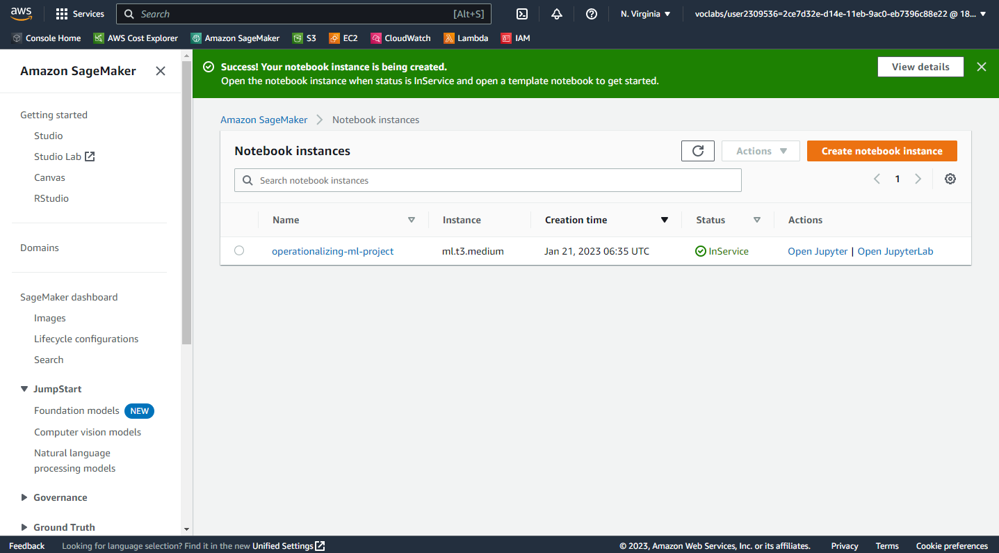
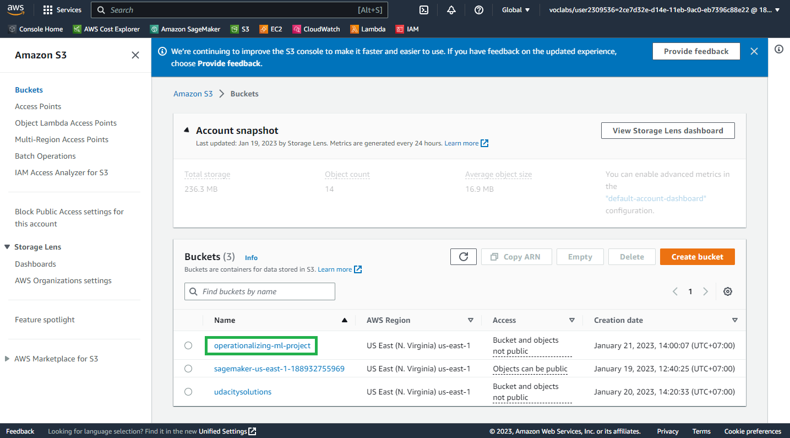
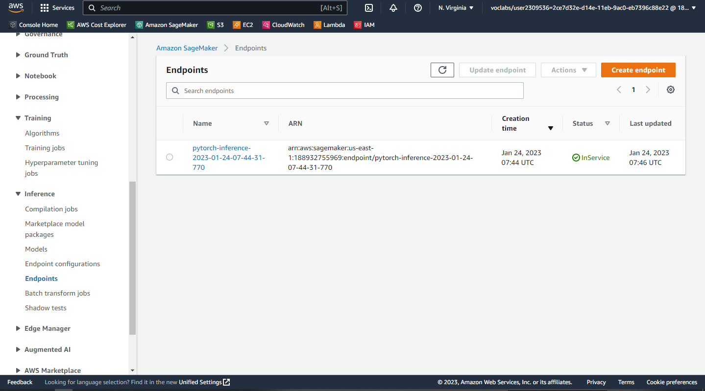
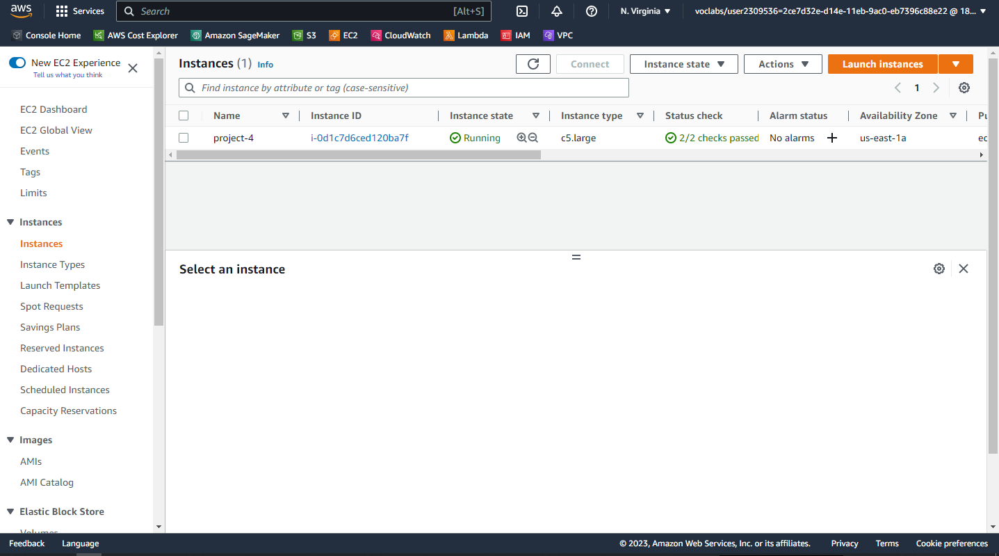
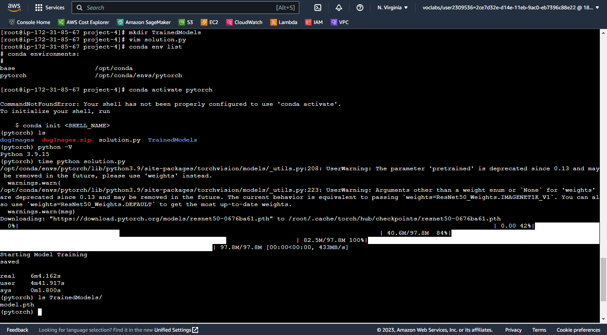
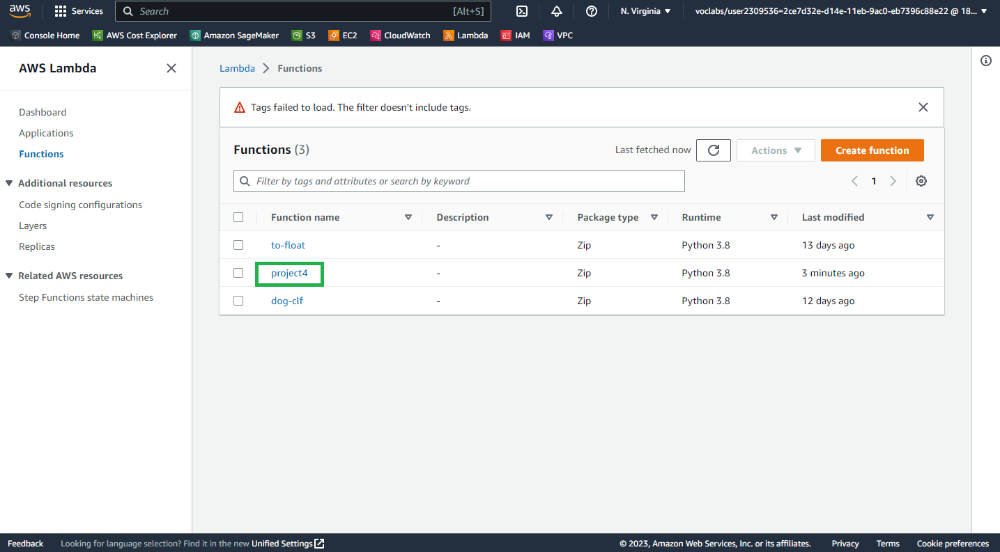
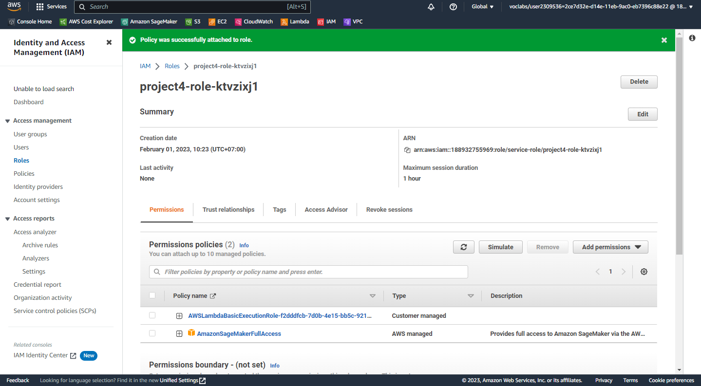
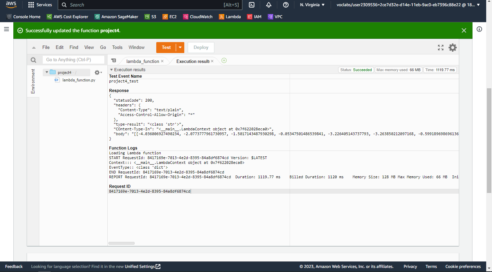
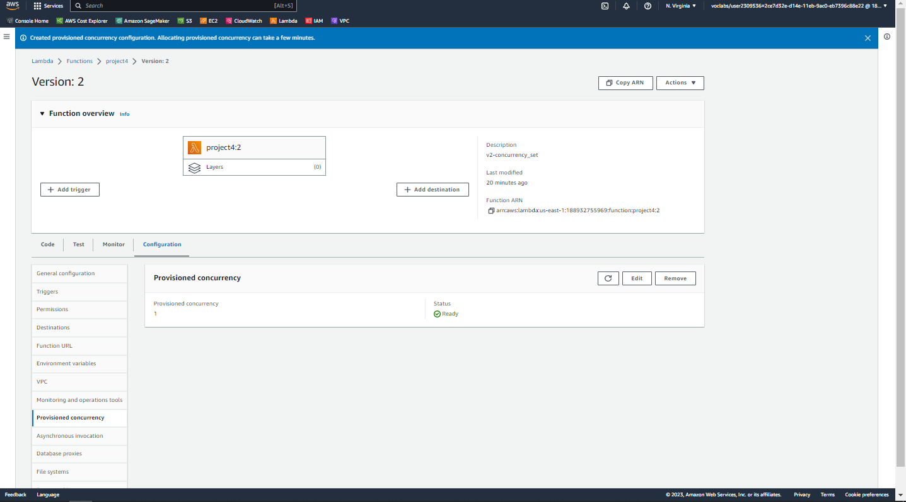
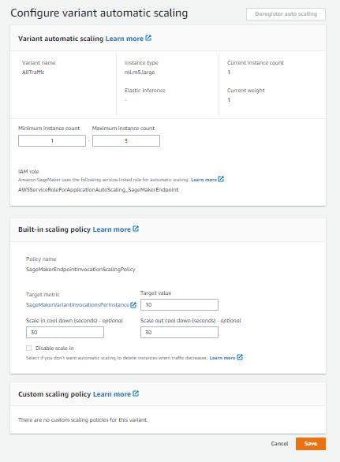

# Operationalizing an AWS ML Project

The goal of this project will be to use several important tools and features of AWS to adjust improve, configure, and prepare a machine learning model for production-grade deployment.

## Training and Deployment on Sagemaker
### Initial Setup
1. Create and open a sagemaker notebook instance
2. Install unzip command
   ```
   sudo yum install unzip -y
   ```
I choose `ml.t3.medium` as the cheapest compute instance just for running the jupyter notebook.



### Download and Upload Data to an S3 Bucket
I create an s3 bucket with name `operationalizing-ml`.
```
wget -nc https://s3-us-west-1.amazonaws.com/udacity-aind/dog-project/dogImages.zip
unzip -q dogImages.zip
aws s3 cp ./dogImages s3://operationalizing-ml/dataset
```



#### Training and Deployment

#### Single Instance
In my opinion, because this training uses a small epoch, I don't need to spend
more for a GPU instance, and a CPU-optimised instance like `ml.c5.2xlarge` is enough.
It charges **$0.408/hour** and took **11 minutes and 3 seconds** to finish training.

#### Multi Instance
For the multi-instance training, I used spot instances. And the cheapest spot
instance available in this account is ml.c5.2xlarge. It provides an affordable
price of **$0.174/hour**. I used 2 instances and took **22 minutes and 33 seconds**
to finish training in total. 
#### Endpoint
I created an endpoint from muli-instance estimator

## EC2 Training
### EC2 Setup
From previous training on Sagemaker, I used ml.c5.2xlarge. When I take a look at
CloudWatch data. It shows me that the training doesn't use that much storage.
So I choose `ml.c5.large` with **Amazon Deep Learning AMI PyTorch 1.13.1 (Amazon Linux 2)**.


### EC2 Model training
Unlike training on sagemaker, the data preparation has to setup manually.

## Sagemaker Training vs EC2 Training
sagemaker:
- invoke a training job
- input data from s3
- save model data to s3

ec2:
- training on local instance
- load data from local instance directory
- save model data to local directory

### Lambda Function
This lambda function will invoke an endpoint `pytorch-inference-2023-01-24-07-44-31-770`.
It only accepts a request with content type `application/json` and returns a data with the
following format:
```python
{
   'statusCode': 200,
   'headers' : { 'Content-Type' : 'text/plain', 'Access-Control-Allow-Origin' : '*' },
   'type-result':str(type(result)),
   'COntent-Type-In':str(context),
   'body' : json.dumps(sss)
}
```
The detail about this lambda function can be found at `src/code/lamdafunction.py`.


### Security and Testing
By default for security purposes, AWS Lambda does not have access to AWS Sagemaker.
Certain authentication methods are required. One of the method is by using `IAM role`
with the corresponding policies. In this case `AmazonSageMakerFullAccess` policy.
It grants the lambda function broader permissions to access SageMaker services.
This scenario will produce vulnerability because the lambda function only needs
permissions to invoke an endpoint from Sagemaker. So using the principle of least
privilege is recommended. The corresponding policy needs to be adjusted to limit
the lambda function to invoke an endpoint only. Also, the old or unused roles
need to be deleted to grant more security.




### Concurrency and Auto-scaling
The main purpose of concurrency and auto-scaling is to reduce latency during
high-traffic scenarios. In this project, I just deal with low-traffic situations.
So a small amount of concurrency is acceptable. I configured concurrency after creating
a version of the lambda function. The only concurrency setting available is provisioned
concurrency.

For the same reason as concurrency, a small amount of instances is acceptable for auto-scaling.
I choose **3** for the maximum instances. It will be triggered if **10** requests come
simultaneously.

